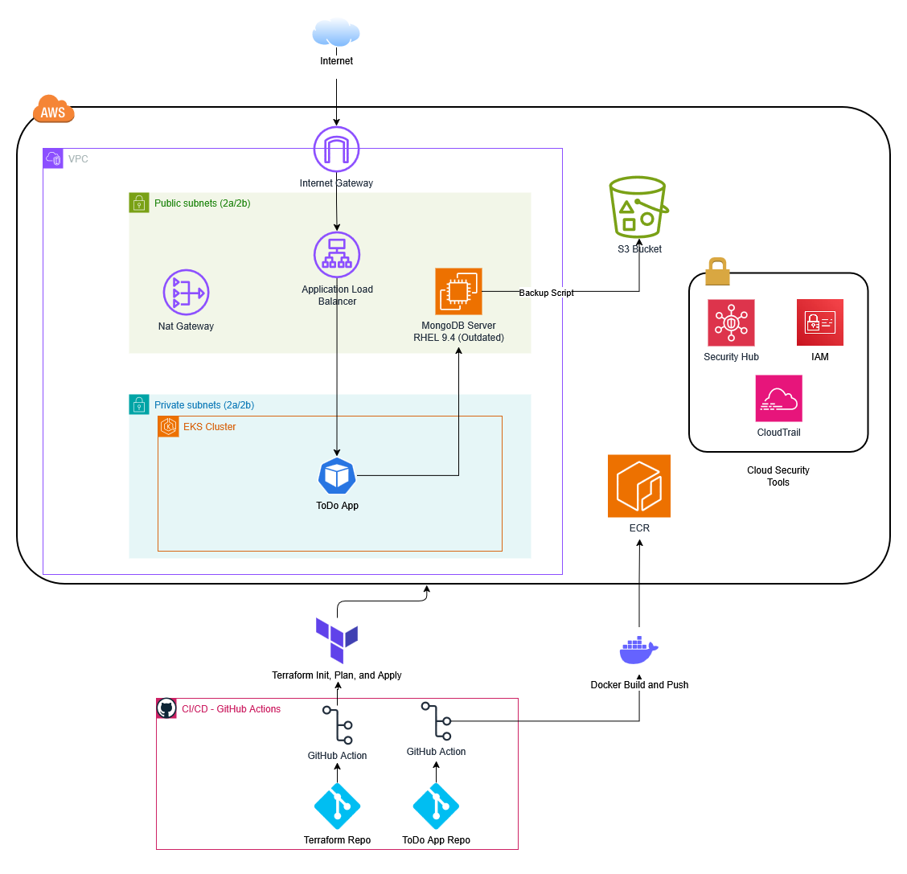

# Wiz Technical Exercise

Terraform infrastructure for a two-tier web application deployed on AWS that is backed by a MongoDB database. 

## Architecture

Internet --> ALB --> EKS --> Todo App --> MongoDB on EC2 --> S3 Backups

## Terraform Information

- Terraform >= 1.14.0
- S3 backend bucket for state 

| Module | Description |
|---|---|
| `networking` | VPC, subnets, IGW, NAT gateway, route tables |
| `iam` | EC2 instance role and overly permissive IAM policy |
| `ec2-mongodb` | MongoDB server with security groups |
| `s3` | Backup bucket with public read/list |
| `eks` | Placeholder - EKS was created manually via AWS console |
| `ecr` | ECR repository to store container images

## CI/CD

GitHub Actions runs `terraform plan` and `terraform apply` on push to `main`. Branch protection ruleset configured to require PRs for all changes.

## Intentional Misconfigurations

The intentional misconfigurations for this project include:
- SSH is exposed to public internet
- Overly permissive IAM (ec2:*, s3:*, lambda:*) attached to Instance profile role 
- S3 bucket with public read/list access
- Uses MongoDB 6.0 (released in July 2022)
- EC2 image uses outdated Linux AMI (RHEL 9.4) - ami-001790a81373de00d
- Container application assigned a cluster-wide kubernetes admin role and privilege 